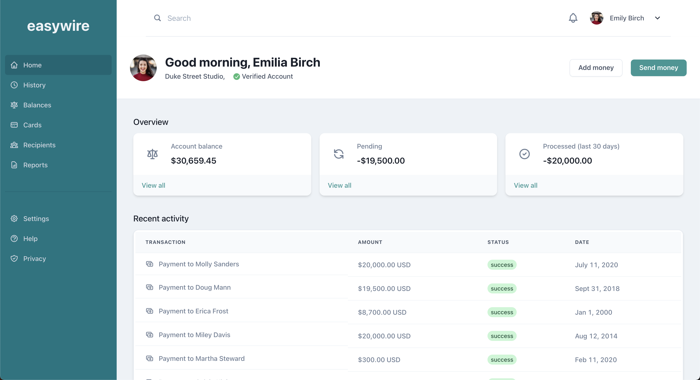

## Easywire

This is a demo application I built on a sunday after feeling inspired to code. This project is the code version this [`ui`]() by the tailwindui team. 
It looked beautiful and complex so I felt challenged to build it in less than a day which I did. 

## Tech Stack
 - Chakra-ui
 - Next.js
 - Easy Peasy
 - React Hook Form 
 - Testing with jest
 

## Screenshot

